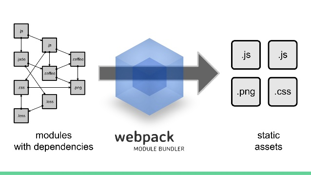

# How-to-Webpack

Aqui hare mis resumenes de un curso de webpack y todo lo demas que encuentre acerca del tema

## Que es Webpack ?

WP es un Module Bundler for Modern JS Applications, es decir un empaquetador de módulos para el desarrollo de aplicaciones modernas en JavaScript.
En su definición sencilla y directa: Es un empaquetador de módulos.
En un contexto mas amplio: Tiene como objetivo principal agrupar los archivos de JavaScript (o sea los módulos, los require(’’./")) para su uso en un navegador, pero también es capaz de transformar, agrupar o empacar muchos otros archivos como CSS (por ejemplo).

## ¿Por qué usar Webpack?

- Aunque hay otras alternativas WP es un la forma mas sofisticada para cargar y transformar módulos. WP trae todas las formas de importación de módulos, en resumen trae lo mejor de todos los mundos (AMD y CommonJS).
    - AMD: Asynchrounous Module Definition => lo usa require.js (usa mas peticiones)
    - CommonJS: Sistema de modulos de nodejs ( una sola petición )
- **Entrypoints:** Múltiples puntos de entrada a tus aplicaciones - archivos iniciales, tienes uno por cada pagina que vayas a usar. 
- Puedes tener multiples entrypoints.
- **OUTPUT:** Si bien le decimos cual es el archivo fuente, debemos decirle que hacer con eso y donde ponerlo, porque no queremos mezclar los archivos finales que lee el navegador con los archivos fuente. En resumen responderemos a las siguientes preguntas:
    - Donde estara el archivo.
    - Como se llamara el archivo.
- **Loaders:** Nos ayudan a cargar todo tipo de formato de archivos.
- **Plugins:** nos ayudan a extender las caracteristicas de WP, por ejemplo comprimir archivos, dividir nuestros modulos en chunks, etc.
- WP es developer experience.

## Diferencia entre Webpack y otras herramientas 

Ir al siguiente documento [webpack vs gulp vs grunt]().

## Colaboradores:

- Cristian F. Sotomayor G. (Autor - Creador del repositorio)

