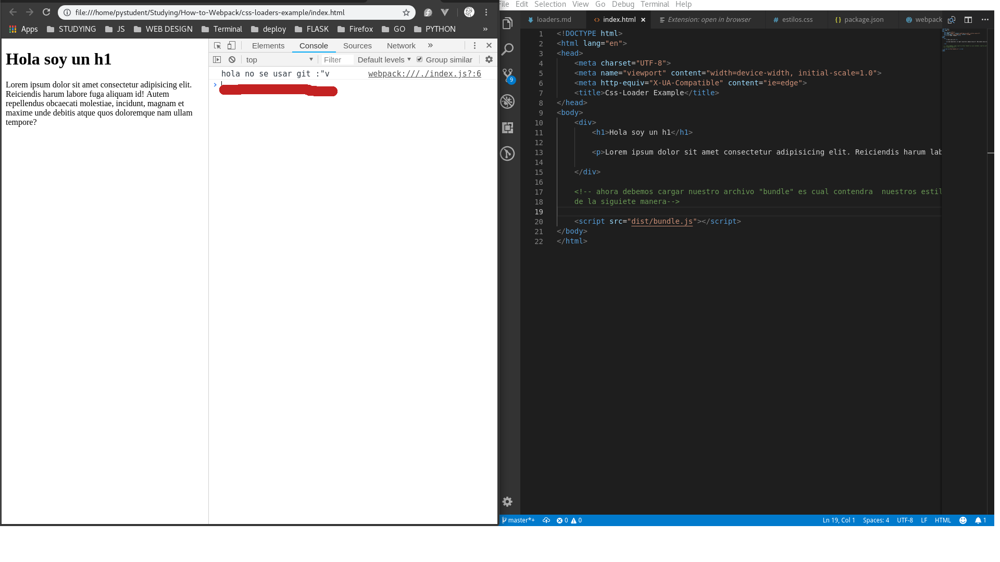
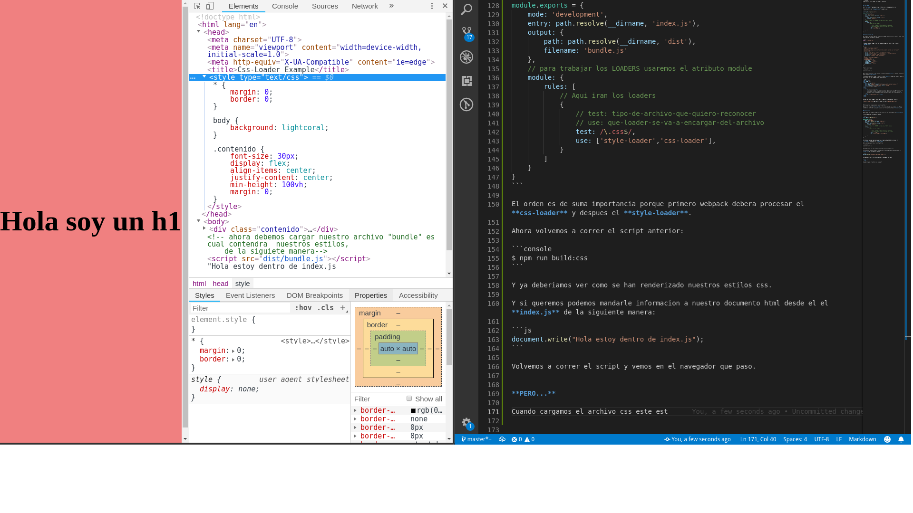

# Trabajar con LOADERS en Webpack

Para trabajar esto vamos a crear una carpeta llamada "css-loader-example" y dentro de ella trabajaremos todo lo relacionado a este tema y aqui comentare ciertas cosas. 


## Que loaders vamos a utilizar ?

Usaremos un **style-loader** y **css-loader**. Y se instalan de la siguiente forma:

```console
$ npm install style-loader css-loader --save-dev
```


## Css-loader

Con **css-loader** podremos cargar archivos css e interpretarlo en Js. 

Y la estructura del **webpack.config** quedaria asi:

```js
const path = require('path');
 
module.exports = {
    mode: 'development',
    entry: path.resolve(__dirname, 'index.js'),
    output: {
        path: path.resolve(__dirname, 'dist'),
        filename: 'bundle.js'
    },
    // para trabajar los LOADERS usaremos el atributo module
    module: {
        rules: {           
            // Aqui iran los loaders
            {
                // test: tipo-de-archivo-que-quiero-reconocer
                // use: que-loader-se-va-a-encargar-del-archivo 
                test: /\.css$/,
                use: ['css-loader']
            }
        }
    }
}
```

**Como haria esto ?**

Por ejemplo podriamos importar un archivo llamado "estilos.css" en nuestro index. Y lo importamos de la siguiente manera:

```js
import "./estilos.css"
```

Y tambien debemos cargarlo asi que debemos agregar un nuevo script a nuestro **package.json**:

{
```json
  "name": "css-loaders-example",
  "version": "1.0.0",
  "description": "este sera nuestra carpeta ejemplo de como usar un loader",
  "main": "index.js",
  "scripts": {
    "test": "echo \"Error: no test specified\" && exit 1",
    "build": "webpack index.js --output bundle.js --mode development",
    "build:local": "webpack --mode development",
    "build:css": "webpack --mode development"
  },
  "author": "Cristian Sotomayor",
  "license": "MIT",
  "devDependencies": {
    "css-loader": "^1.0.0",
    "style-loader": "^0.23.1",
    "webpack": "^4.20.2",
    "webpack-cli": "^3.1.2"
  }
}
```

Y ahora lo corremos:

```console
$ npm run build:css
```

Ahora para renderizar lo que hicimos al cargar nuestro **css**, cr earemos un archivo html llamado **index.html**.

Y lo que haremos sera llamar a nuestro archivo **bundle** desde html como lo vemos en el archivo. Una vez cargado con el codigo actual:

```html
<!DOCTYPE html>
<html lang="en">
<head>
    <meta charset="UTF-8">
    <meta name="viewport" content="width=device-width, initial-scale=1.0">
    <meta http-equiv="X-UA-Compatible" content="ie=edge">
    <title>Css-Loader Example</title>
</head>
<body>
    <div>
        <h1>Hola soy un h1</h1>
        <p>Lorem ipsum dolor sit amet consectetur adipisicing elit. Reiciendis harum labore fuga aliquam id! Autem repellendus obcaecati molestiae, incidunt, magnam et maxime unde debitis atque quos doloremque nam ullam tempore?</p>
    </div>
    <script src="dist/bundle.js"></script>
</body>
</html>
```

Veremos que no se carga el color, pero si aparece el mensaje en  consola:




Entonces porque no aparecieron nuestros estilos ?

Porque solo usamos el **css-loader** y este solo entiende los archivos css. Y para entenderlos dentro del navegador debemos usar el siguiente loader **style-loader**.


## Style-loader

Este loader nos permmite renderizar el arhivo css que ya cargamos con **css-loader**.

Y lo agregamos de la siguiente manera:

```js
const path = require('path');
 
module.exports = {
    mode: 'development',
    entry: path.resolve(__dirname, 'index.js'),
    output: {
        path: path.resolve(__dirname, 'dist'),
        filename: 'bundle.js'
    },
    // para trabajar los LOADERS usaremos el atributo module
    module: {
        rules: [       
            // Aqui iran los loaders
            {
                // test: tipo-de-archivo-que-quiero-reconocer
                // use: que-loader-se-va-a-encargar-del-archivo 
                test: /\.css$/,
                use: ['style-loader','css-loader'],
            }
        ]
    }
}
```
 
El orden es de suma importancia porque primero webpack debera procesar el **css-loader** y despues el **style-loader**.

Ahora volvemos a correr el script anterior:

```console
$ npm run build:css
```

Y ya deberiamos ver como se han renderizado nuestros estilos css.

Y si queremos podemos mandarle informacion a nuestro documento html desde el el **index.js** de la siguiente manera:

```js
document.write("Hola estoy dentro de index.js");
```

Volvemos a correr el script y vemos en el navegador que paso.


**PERO...**

Cuando cargamos el archivo css este se va a mostrar dentro del documento **HTML** en la parte de script como se ve a continuacion:





Entonces si queremos que esto se muestre en un archivo aparte deberemos usar un **plugin**.
