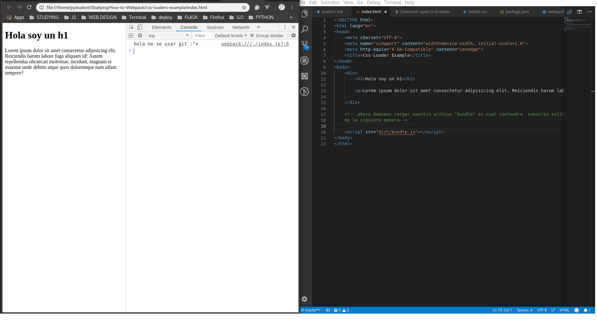
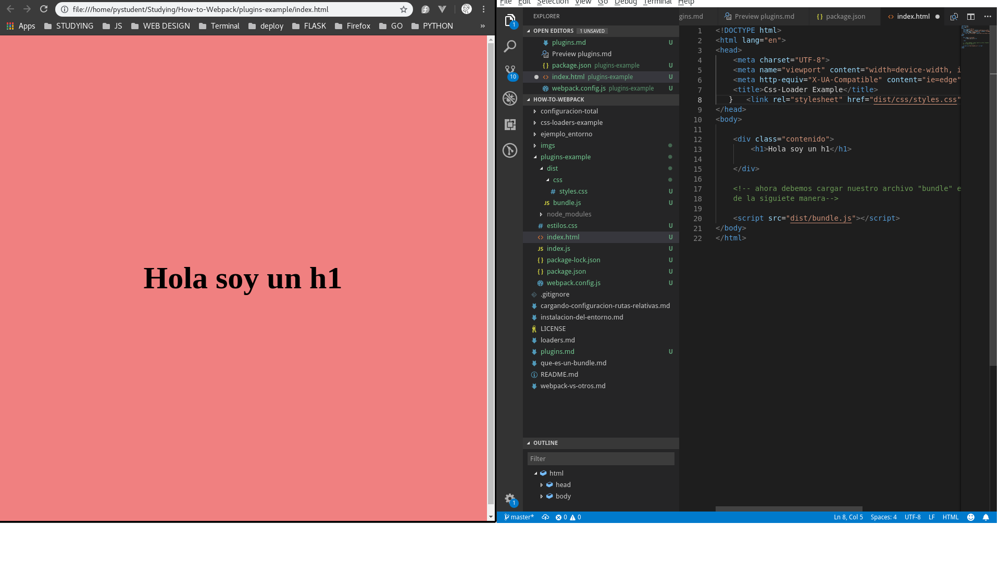

# Plugins

Esta vendria a ser la "continuacion" de loaders, porque complementariamos el proyecto anterior y estariamos siguiendo la linea de la idea. Ahora, como estariamos usando el mismo proyecto cree una nueva carpeta llamada **"plugins example"** para continuar con el mismo proyecto y a la vez dejar el proyecto de ejemplo de **loaders** como estaba. 


## Ahora a el problema anterior

Nosotros al llamar el archivo css, inyectabamos el codigo css mediante una etiqueta **style** (creo xdxd). Pero nosotros queremos tenerlo en un archivo aparte, y como hariamos esto ? 

## Usaremos el plugin MiniCssExtractPlugin

Asi que primero, debemos instalarlo con el siguiente comando:

```console
$ npm install mini-css-extract-plugin --save-dev
```

**Ojo:** Esto es para la version 4.x de webpack en adelante. Porque antes se usaba **ExtracTextWebpack**.


Ahora debemos agregar este plugin a nuestro archivo **webpack.config**:

Para esto debemos importar el plugin que descargamos, de la siguiente manera:

```js
const MiniCssExtractPlugin = require('mini-css-extract-plugin');
```

Y luego usarlo dentro de nuestra configuracion de webpack (lo ubicaremos en otro atributo llamado plugins):

```js
    plugins: [
        // Aqui iran los plugins
        new MiniCssExtractPlugin({
            filename: 'estilos.css'
        })
    ]
```

Y quedaria asi:

```js
const path = require('path');
// para un plugin deberemos importarlo como se hace normalmente en js
const MiniCssExtractPlugin = require('mini-css-extract-plugin');


module.exports = {
    mode: 'development',
    entry: path.resolve(__dirname, 'index.js'),
    output: {
        path: path.resolve(__dirname, 'dist'),
        filename: 'bundle.js'
    },
    // para trabajar los LOADERS usaremos el atributo module
    module: {
        rules: [       
            // Aqui iran los loaders
            {
                // test: tipo-de-archivo-que-quiero-reconocer
                // use: que-loader-se-va-a-encargar-del-archivo 
                test: /\.css$/,
                use: ['style-loader','css-loader'],
            }
        ]
    },
    plugins: [
        // Aqui iran los plugins
        new MiniCssExtractPlugin({
            filename: 'css/styles.css'
        })
    ]
}
```

Hasta aqui le decimos **que archivos estamos extrayendo** pero no decimos que tipo de archivo es este. ¿Como hago esto?.

De la siguiente manera:

```js
module.exports = {
    mode: 'development',
    entry: path.resolve(__dirname, 'index.js'),
    output: {
        path: path.resolve(__dirname, 'dist'),
        filename: 'bundle.js'
    },
    module: {
        rules: [       
            { 
                test: /\.css$/,
                use: [
                    MiniCssExtractPlugin.loader,
                    //'style-loader',
                    // ahora ya no necesitamos style-loader
                    'css-loader'
                ],
            }
        ]
    },
    plugins: [
        // Aqui iran los plugins
        new MiniCssExtractPlugin({
            filename: 'css/styles.css'
        })
    ]
}
```

Ahora, como se pude ver ya no usariamos el **style-loader** porque ahora no necesitariamos saber que el codigo es **css** para inyectarl odebido a que ahora lo queremos en otro archivo que ya tendra la extension predeterminada. 

Y tambien necesitamos configurar nuestro archivos **package.json**, agregandole el siguiente script:

```json
  "scripts": {
    "build:extract:css": "webpack --mode development"
  },
```


Que quedaria asi:

```json
{
  "name": "plugins-example",
  "version": "1.0.0",
  "description": "este sera nuestra carpeta ejemplo de como usar un plugins",
  "main": "index.js",
  "scripts": {
    "test": "echo \"Error: no test specified\" && exit 1",
    "build": "webpack index.js --output bundle.js --mode development",
    "build:local": "webpack --mode development",
    "build:css": "webpack --mode development",
    "build:extract:css": "webpack --mode development"
  },
  "author": "Cristian Sotomayor",
  "license": "MIT",
  "devDependencies": {
    "css-loader": "^1.0.0",
    "mini-css-extract-plugin": "^0.4.4",
    "style-loader": "^0.23.1",
    "webpack": "^4.20.2",
    "webpack-cli": "^3.1.2"
  }
}
```
Y este seria el resultado luego de correrlo, y quedaria lo siguiente:





Despues de correrlo podemos notar una serie de cosas: 

1. Lo primeroo es que se ha creado una carpeta llamada **"css"** dentro de la carpeta "dist" y esta contiene a nuestro archivo **styles.css**.
2. Y lo segundo es que los estilos css no estan aplicados en nuestro documento html.


Y lo segundo seria un problema para nosotros, que deberiamos hacer ?

Debido a que ahora no estamos usando **style-loader** no estamos incrustando el codigo css dentro del html, sino que estamos creando un archivo css y ahora debemos anexarlo de la manera tradicional especificando la ruta desde el html:

```html
    <link rel="stylesheet" href="dist/css/styles.css">
```

Y nos quedaria asi:

```html
<!DOCTYPE html>
<html lang="en">
<head>
    <meta charset="UTF-8">
    <meta name="viewport" content="width=device-width, initial-scale=1.0">
    <meta http-equiv="X-UA-Compatible" content="ie=edge">
    <title>Css-Loader Example</title>
    <link rel="stylesheet" href="dist/css/styles.css">
</head>
<body>     
    
    <div class="contenido"> 
        <h1>Hola soy un h1</h1>
    </div>
    <script src="dist/bundle.js"></script>
</body>
</html>
```

Y ahora si deberiamos de poder ver los estilos siendo aplicados.




Entonces que ganamos haciendo esto?

Podemos usar multiples **loaders** para distintos archivos leerlos, luego archivarlos y llamarlos dentro de nuestro Html.

## Y siempre se llamaran igual mis archivos ? Aplicando comodines

Si queremos que se guarde con un nombre mas flexible y personalizado podemos cambiar esta parte del codigo de webpack.config:

```js
    plugins: [
        // Aqui iran los plugins
        new MiniCssExtractPlugin({
            filename: 'css/[name].css'
        })
    ]
```

Usando el comodin **[ name ]** el archivo que nos devolvera (output) sera el mismo que el del que estamos cargando (input).

```js
const path = require('path');
// para un plugin deberemos importarlo como se hace normalmente en js
const MiniCssExtractPlugin = require('mini-css-extract-plugin');


module.exports = {
    mode: 'development',
    entry: path.resolve(__dirname, 'index.js'),
    output: {
        path: path.resolve(__dirname, 'dist'),
        filename: 'bundle.js'
    },
    // para trabajar los LOADERS usaremos el atributo module
    module: {
        rules: [       
            // Aqui iran los loaders
            {
                // test: tipo-de-archivo-que-quiero-reconocer
                // use: que-loader-se-va-a-encargar-del-archivo 
                test: /\.css$/,
                use: ['style-loader','css-loader'],
                use: [
                    MiniCssExtractPlugin.loader,
                    //'style-loader',
                    // ahora ya no necesitamos style-loader
                    'css-loader'
                ]
            }
        ]
    },
    plugins: [
        // Aqui iran los plugins
        new MiniCssExtractPlugin({
            filename: 'css/[name].css'
        })
    ]
}
```

Ahora veamos que nos devolvera luego de que corramos el script, una vez corrido nos damos cuenta que el nombre que tiene el archivo creado es **main.js** porque ? porque al ser el unico entry point por defecto este seria el nombre del archivo. 
Ahora acontinuacion aprenderemos como lidiar con muchos **entry points** y ponerle nombres personalizados. 


