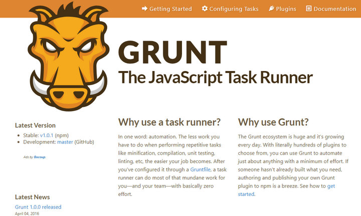
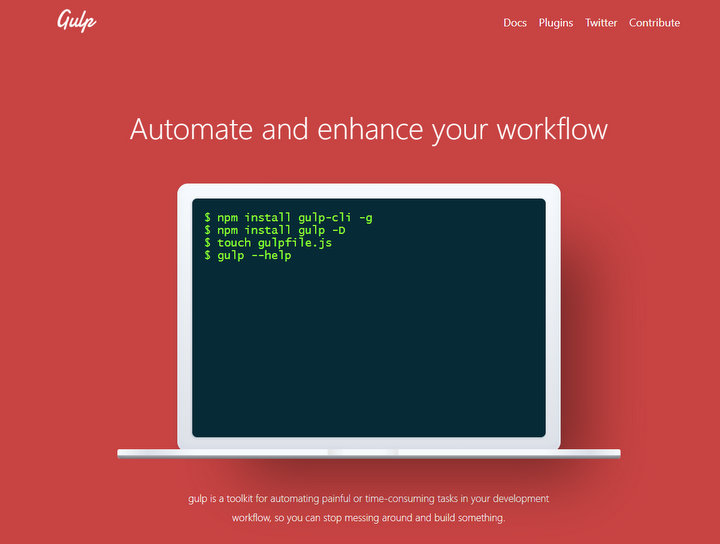
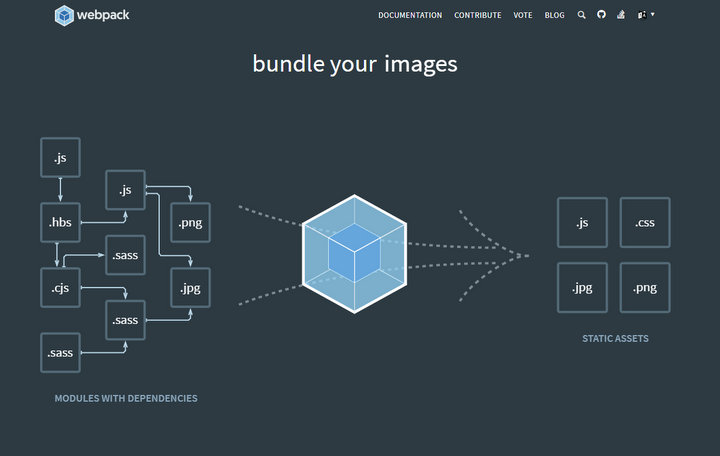
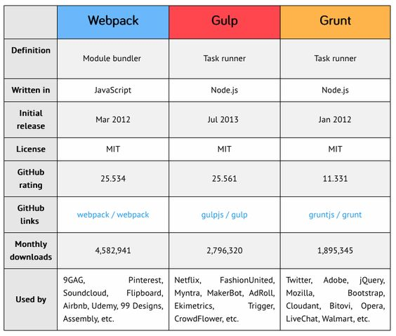

# Webpack vs Gulp vs Grunt

## En link o los links para mas referencia estaran aqui a continuacion:

- [Gulp vs Grunt vs Webpack](https://da-14.com/blog/gulp-vs-grunt-vs-webpack-comparison-build-tools-task-runners)
- []()
- []()


## Ahora lo importante: Las diferencias entre webpack y otras herramientas

**Gulp y Grunt:**

Automatizador de tareas, prácticamente tu configuras la herramienta y este hace varias cosas por ti, minificar, transpilar, compilar código, etc. Grunt salio primero y Gulp mejoro varias cosas de este, como por ejemplo es mucho más veloz.

- **Grunt - Ejemplo** [link](https://gruntjs.com/)




```js
module.exports = function(grunt) {
  grunt.initConfig({
    pkg: grunt.file.readJSON('package.json'),
    uglify: {
      options: {
        banner: '/*! <%= pkg.name %> <%= grunt.template.today("yyyy-mm-dd") %> */\n'
      },
      build: {
        src: 'src/<%= pkg.name %>.js',
        dest: 'build/<%= pkg.name %>.min.js'
      }
    }
  });

  grunt.loadNpmTasks('grunt-contrib-uglify');

  grunt.registerTask('default', ['uglify']);
};
```

- **Gulp - Ejemplo**




```js
gulp.task('nombreDeLaTarea', function(){
  return gulp.src('./ruta/del/archivo.css')
    .pipe(minifiCSS())
    .pipe(gulp.dest('./lugar/de/destino'))
});
```


- **Browserify:** Solo nos permite usar “require” en el navegador, agrupando todas nuestra dependencias.

- **Webpack:** Viene siendo un empaquetador de módulos, y también nos permite hacer una que otra cosa que hace gulp o grunt. Lo padre de webpack es que nos permite dividir cada módulo en distas maneras haciendo que el dev. tenga un mejor control para distintas situaciones yproblemas.








